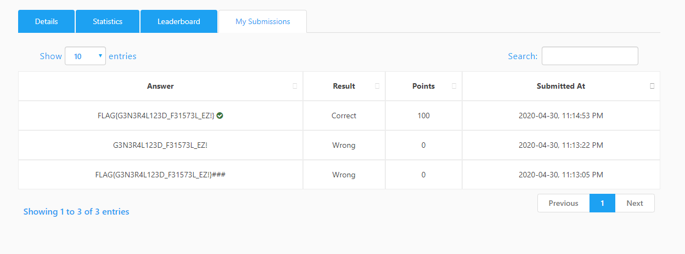

# Genfie CTF Challenge

#### Challenge Link:
[Click here](https://cybertalents.com/challenges/cryptography/genfei) 

#### Solution Discussion: 
#### Encryption:- 
given encryption function encrypt input  
with two steps in each iteration:-
##### Step 1:-
    a = b ^ F(a | F(c ^ F(d)) ^ F(a | c) ^ d);
    
    b = c ^ F(a ^ F(d) ^ (a | d));
    
    c = d ^ F(a | F(a) ^ a);
    
    d = a ^ 31337;

##### Step 2:-
    a = c ^ F(d | F(b ^ F(a)) ^ F(d | b) ^ a);
    
    b =  b ^ F(d ^ F(a) ^ (d | a));
    
    c = a ^ F(d | F(d) ^ d); 
    
    d = d ^ 1337;

and repeat these steps 32 times.

#### Decryption:- 

to decrypt this simply we reverse these steps to make decryption 

##### decrypting the second step in encrypt
        old_a = a
        d = d ^ 1337
        a = c ^ (F(d | F(d) ^ d))
        b = b ^ (F(d ^ F(a) ^ (d | a)))
        c = old_a ^ (F(d | F(b ^ F(a)) ^ F(d | b) ^ a))
##### decrypting the first step in encrypt
        old_a = a
        a = d ^ 31337
        d = c ^ (F(a | F(a) ^ a))
        c = b ^ (F(a ^ F(d) ^ (a | d)))
        b = old_a ^ (F(a | F(c ^ F(d)) ^ F(a | c) ^ d)) 
and also repeat these steps 32 to decrypt flag

#### Submission ScreenShot:- 
 
